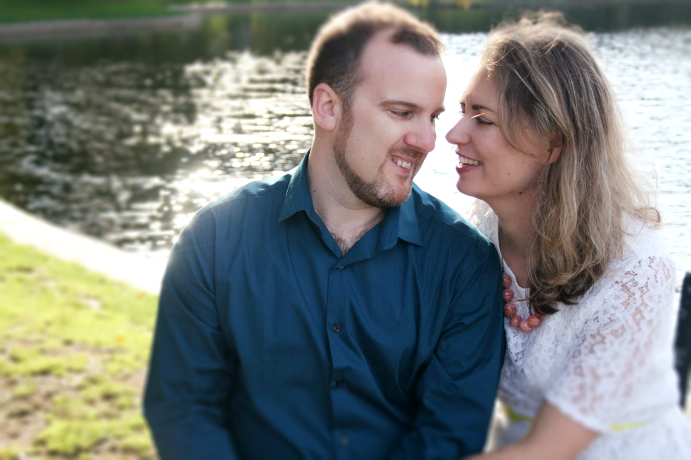
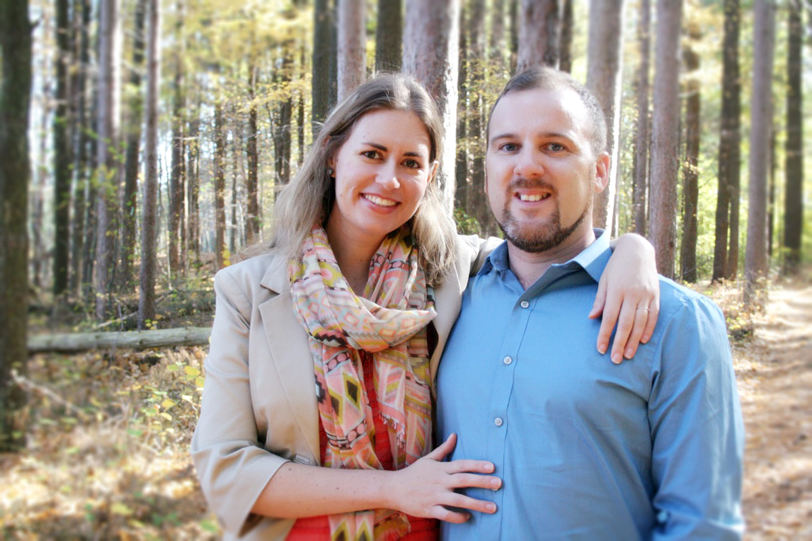

##About Us

#ALISTAIR GRAHAM MACDONALD

Alistair is a software developer working for [Radial Analytics](http://radialanalytics.com) in Cambridge.  As a young boy, Al (or Ali, a la Ali-Babba, as he is known to his childhood family and friends) learned to write code by tinkering on micro-computers that his father would bring home from his work as a software developer.  Ali spent many of his boyhood hours writing computer games, puzzles, and saving them onto floppy-disks.

The eldest of three, Al grew up on the outskirts of sunny[*](#sunny) London.  While Al ended up leaving England, His brothers and parents are all still in there, which will mean lots of time across the pond for our intrepid explorers. 

Alistair is descended from a long line of Scotsmen on his father's side - the family line can be traced back nearly 14 generations.  Interestingly, his dad's side is also mildly nomadic, so it is perhaps not surprising he ended up moving to America.  Both Al's grandfather - a Canadian who lived in the states - and his father - who grew up in America and moved to England - switched countries in their lifetimes. Al often gets asked why he moved, which is always interesting and bit awkward, since he moved for a different girl that he was dating in his mid 20s. _(Spoileralert: it didn't work out.)_

Some of the most awesome things that Al's done have included co-founding a tech startup in Boston called [Bocoup](http://bocoup.com) in Boston, working as a VideoJockey in the London club scene, climbing to the Everest base camp in Nepal, riding 500 miles from Boston to Baltimore during a week long trip to support World Relief and writing his own music and songs. He can even play the harp.

_*London is actually not <a name="sunny">sunny</a>._

#AMANDA MAY WEYERS

Amanda is a biochemist currently working as a Post-Doctoral Associate at [Momenta Pharmaceuticals](http://www.momentapharma.com/) in Cambridge.  Amanda began studying chemistry first at college and then in graduate school in upstate New York.  Although she studied chemistry in school, she has recently begun to learn more about biology and medical research since the start of her postdoc.  

Amanda grew up in upstate New York, only a few hours from Boston.  Also the eldest of three, she spent a lot of her time growing up with a book in hand.  _(Fun fact: her parents use to threaten to take away library books to get her to clean her room.  It was mildly effective.)_ 

Amanda's family is also prone to be a bit nomadic.  Not only was each sister born in a different state, but they each currently live in a different time zone. In fact, no two sisters have ever lived in the same state at the same time since high school.

Amanda spent a year living in Madrid while in school, and then three years between college and graduate school working for [Adventures in Missions](http://www.adventures.org/), working to strengthen poor communities in Mexico, Philadelphia, the Dominican Republic and Swaziland.  Between her years traveling abroad and her time spent with international students at graduate school, Amanda is just as comfortable with foreigners as Americans; friends have generally expressed a lack of surprise to hear her fiance has a green card.

Besides living in foreign countries and getting her Ph.D., some of the most awesome things that Amanda has done include running a marathon in the Adirondacks, summiting a mountain in the Wind River range in beautiful Wyoming and learning sign language.
